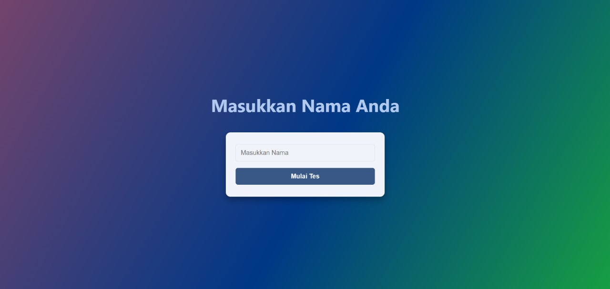

<h1 align="center">📘 Cermatify</h1>

## 📝 Deskripsi Singkat Proyek

**Cermatify** adalah aplikasi berbasis Java yang menggunakan HTTP server sederhana untuk menyajikan kuis. Kuis ini bertujuan untuk melatih kecermatan dalam mencari soal yang hilang.

Aplikasi ini memungkinkan pengguna menjawab soal, mengirimkan jawaban, dan melihat peringkat berdasarkan skor. Seluruh interaksi dilakukan melalui antarmuka web yang dibangun secara dinamis.

## ✨ Fitur Aplikasi

-   Menyediakan soal pilihan ganda secara dinamis.
-   Form pengisian nama dan jawaban peserta.
-   Penilaian otomatis setelah jawaban dikirim.
-   Menampilkan skor dan leaderboard peserta.

## 🧱 Struktur Class

| Nama Class         | Deskripsi                                                                |
| ------------------ | ------------------------------------------------------------------------ |
| `Main`             | Kelas utama yang menjalankan HTTP server dan mendaftarkan semua handler. |
| `StaticHandler`    | Menyediakan file statis (HTML/CSS) dari direktori lokal.              |
| `FormHandler`      | Menyediakan form input nama peserta.                                     |
| `HTMLGenerator`    | Menghasilkan HTML untuk soal, form, hasil, dan leaderboard.              |
| `JawabSoalHandler` | Menerima jawaban peserta dan menghitung skor.                            |
| `LeaderboardUtils` | Menyimpan data peserta dan menghasilkan leaderboard.                     |
| `Peserta`          | Struktur data peserta: nama dan skor.                                    |
| `Soal`             | Representasi struktur soal dan jawaban benar.                            |
| `SoalGenerator`    | Menghasilkan soal secara otomatis (random).                              |
| `SoalHandler`      | Menyediakan halaman soal kuis.                                           |

## 🔄 Alur Kerja Aplikasi

1. **Akses Halaman Utama:** Pengguna membuka `localhost:8080/`.
2. **Isi Form Nama:** Form meminta nama peserta untuk mengikuti kuis. Lalu muncul halaman pembuka.
3. **Tampilan Soal:** Soal disajikan dalam bentuk HTML (generated).
4. **Pengiriman Jawaban:** Peserta mengirimkan jawaban.
5. **Penilaian:** Jawaban dinilai dan skor ditampilkan.
6. **Leaderboard:** Hasil peserta disimpan dan diperlihatkan.

## ▶️ Cara Menjalankan Program

### Persyaratan

-   Java JDK 8 atau lebih tinggi.
-   **IDE** atau editor teks (IntelliJ IDEA, VS Code, dll).

### Langkah Menjalankan

```bash
javac src/*.java
java src/Main.java
```

Aplikasi berjalan di `http://localhost:8080/`.

### Fitur tambahan andalan
Aplikasi bisa diakses oleh public dengan menggunakan ip dari perangkat yang menjalan program dengan syarat terhubung dalam satu jaringan. Akses URL berikut pada browser perangkat lain:

`http://[IPv4 perangkat]:8080`

## 🛠️ Teknologi yang Digunakan

-   Bahasa Pemrograman: Java
-   HTTP Server: `com.sun.net.httpserver.HttpServer`
-   HTML Dinamis: Dibuat melalui Java
-   Penyimpanan data: File data.csv

## 👥 Pembagian Tugas per Anggota

| Nama Anggota | Tugas                                  |
| ------------ | -------------------------------------- |
| **Chandra**  | `Main`, `HTMLGenerator`,               |
| **Fera**     | `Peserta`, `Soal`                      |
| **Izzah**    | `StaticHandler`, `SoalGenerator`       |
| **Satria**   | `SoalHandler`, `FormHandler`           |
| **Imam**     | `LeaderboardUtils`, `JawabSoalHandler` |

## 🖼️ Tampilan Aplikasi

### Halaman Form Nama:



### Halaman Awal:


### Halaman Soal:


### Hasil Setelah Submit:


### Leaderboard:


## 📂 Catatan Tambahan

-   Semua file `.java` harus berada dalam satu folder.
-   Class Main dijalankan dari folder utama.

## 📄 Lisensi

Proyek ini dibuat untuk tujuan pembelajaran dan bebas digunakan serta dimodifikasi.

_**Salam kami Kelompok 6B.**_
